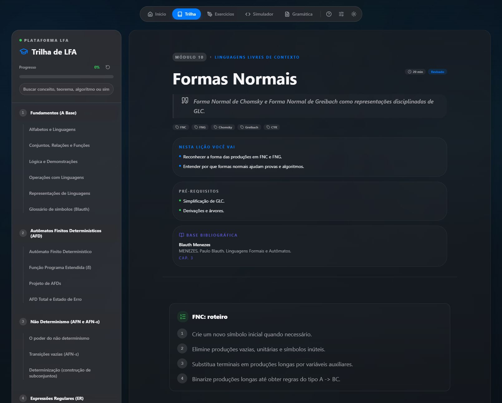
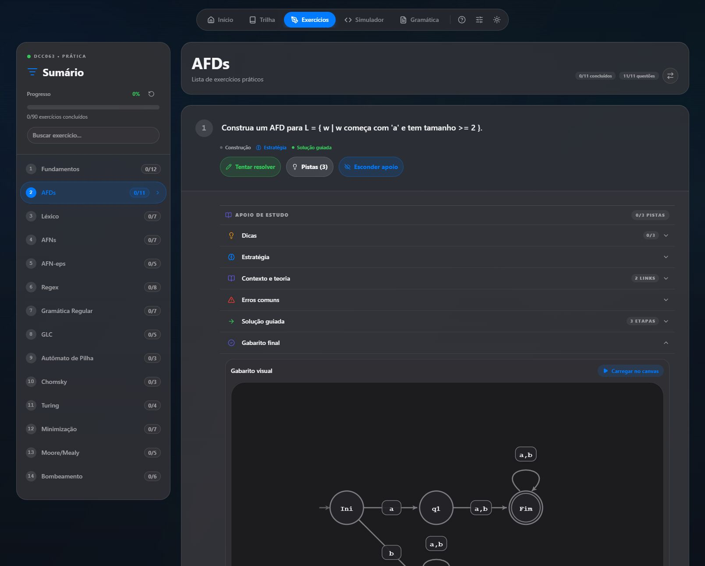
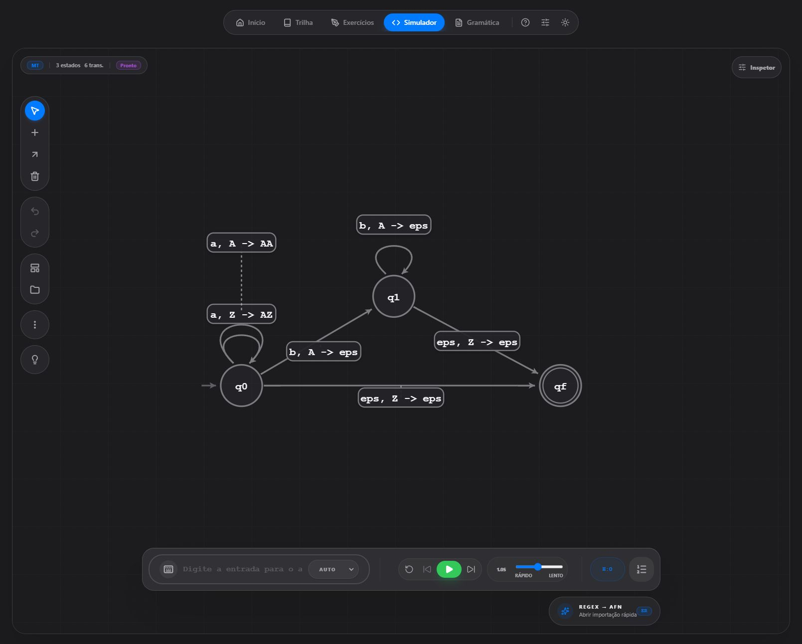
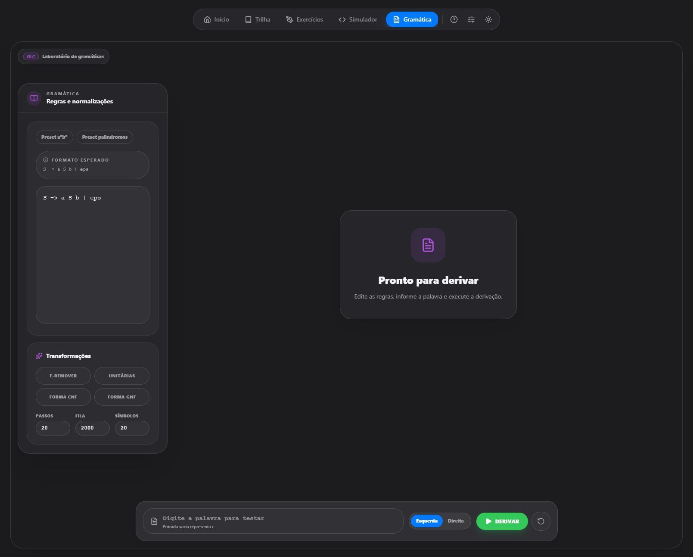

# LFA Web

[Acesse a versão publicada](https://danielportes.github.io/LFA-web/)
```text
https://danielportes.github.io/LFA-web/
```

Aplicação React + TypeScript + Vite para estudo e simulação de conteúdos de Linguagens Formais e Autômatos.

## Capturas de tela

As capturas abaixo mostram as principais páginas.

### Início


### Trilha



### Exercícios



### Simulador



### Gramática



## Requisitos

- Node.js 22+
- npm 10+
- Docker 26+ com Docker Compose

## Desenvolvimento local

```bash
npm install
npm run dev
```

## Build e validação

```bash
npm run build
npm run lint
npm run test
```

## Docker para desenvolvimento

O alvo `dev` sobe o Vite com HMR acessível fora do contêiner.

```bash
docker compose --profile dev up --build
```

A aplicação fica disponível em `http://localhost:5173`.

## Docker para produção

O alvo `production` gera o build estático e publica a SPA em `nginx`, com fallback para `index.html` e `PORT` configurável para plataformas de host.

```bash
docker compose --profile prod up --build
```

Por padrão, a aplicação sobe em `http://localhost:8080`.

Para executar sem Compose:

```bash
docker build --target production -t lfa-web .
docker run --rm -e PORT=8080 -p 8080:8080 lfa-web
```

## Deploy em plataformas de host

- Use o `Dockerfile` da raiz como fonte de build.
- O estágio final já expõe um servidor HTTP pronto para SPA.
- A porta é lida da variável de ambiente `PORT`, padrão `8080`.
- Em ambientes com build por contêiner, não é necessário instalar Node manualmente no host.

## CI/CD

- `CI`: executa lint, testes, build e valida os alvos Docker `dev` e `production`.
- `Deploy GitHub Pages`: publica a versão estática no GitHub Pages com `base path` ajustado para o nome do repositório.
- `Publish Docker Image`: publica a imagem de produção no GHCR em `ghcr.io/danielportes/lfa-web`.

URL esperada do site publicado:

```text
https://danielportes.github.io/LFA-web/
```
